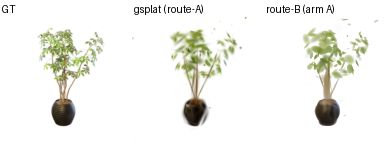
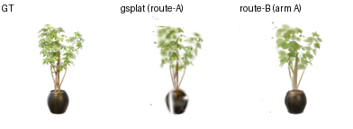
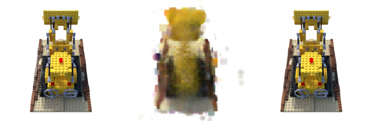
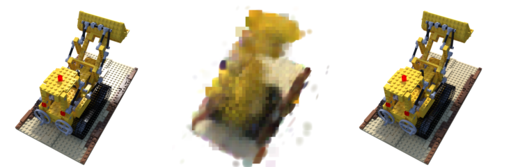
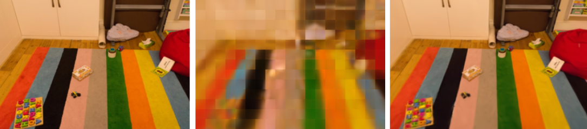
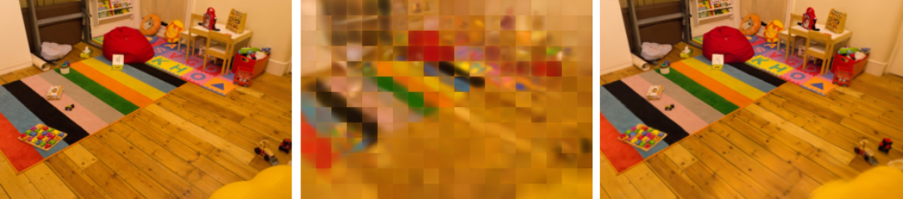

# tt-splat — 3D Gaussian Splatting on Tenstorrent Blackhole

A 3D Gaussian Splatting (3DGS) **renderer + trainer** rewritten so that the entire hot path is a
**matrix multiply**, built to run on a **Tenstorrent Blackhole** accelerator (p150a: 120 Tensix
cores, ~180 MB on-chip SRAM, 32 GB GDDR6, 512 GB/s, ~332 TFLOPS BF16).

> **The goal is not to beat NVIDIA on absolute speed — it is to win on perf/$** by running a
> Gaussian-splatting workload in the regime Blackhole is strongest in (matrix-engine-bound,
> SRAM-resident) instead of the regime standard 3DGS lives in (transcendental + sort + scatter,
> all of which are Tensix's weakest paths).

---

## What this is

Standard 3DGS renders by evaluating, per pixel per gaussian, an `exp()`-based gaussian weight, then
**depth-sorting** the gaussians and **alpha-compositing** front-to-back. On a Tenstorrent part those
are exactly the slow paths: the SFPU (transcendentals) is ~64× slower than the matrix engine, and the
sort / irregular scatter are branch-heavy.

tt-splat takes a different approach we call **matrix-native 3DGS**: it changes the *math* of the
renderer so the work becomes a chain of GEMMs and the matrix engine — Tenstorrent's Tensix MVMUL unit —
is the dominant unit. After the rewrite the whole forward and backward pass collapses to the shape
of a tiny neural-net layer — **`GEMM → cheap pointwise → GEMM`** — and exactly two non-matrix residuals
remain (a `clamp+square`, and a fixed-capacity bucket scatter). The full derivation is in
**[`docs/bh-port-math.md`](docs/bh-port-math.md)**.

Because the renderer's math is different, **pre-trained public `.ply` assets do not transfer** — every
scene is trained from scratch against our own renderer. Training is therefore a first-class part of the
project, and it runs **on the Blackhole device** (params + optimizer state resident on-card, geometry +
render + loss + Adam all on-device, captured as a single traced graph).

---

## Key features

- **No `exp`.** The gaussian weight is a polynomial splat `w = o·(1 − Q/k)₊²`. Transcendental count = 0;
  the residual is one `max(0,·)` + one square.
- **No depth sort.** Blending is **Weighted Sum Rendering** (WSR), `C = Σwᵢcᵢ / Σwᵢ` — order-independent,
  and itself a GEMM.
- **The quadratic form is an *exact* GEMM.** `Q[P×G] = Φ[P×6] · θᵀ[6×G]`, where `Φ` is a per-pixel
  monomial basis shared across all gaussians and `θ` packs each gaussian's conic + mean. This is an
  algebraic identity (monomial expansion), not an approximation.
- **Backward is also GEMMs — for free.** Reverse-mode differentiation of a matmul is a (transposed)
  matmul, so the whole gradient path is transposed GEMMs separated by the same two cheap pointwise ops.
- **Fixed gaussian count (MCMC).** Density control is 3DGS-MCMC (SGLD + contribution-preserving
  relocation); buffers are allocated once and never resized — no dynamic densification/scatter.
- **Spatial-hash binning, fixed per-tile budget K.** Each gaussian scatters to one cell; each tile
  gathers a fixed `K` (overflow dropped). Fixed-length tensors, L1-resident, **measured lossless at
  (R=1, K=128)** vs the dense render.
- **Device-resident + traced.** Render fwd/bwd, geometry fwd/bwd, the photometric loss/SSIM gradient,
  binning, and Adam all run on-device as one captured (CUDA-Graph-equivalent) trace, so per-iteration
  host↔device sync is removed.

---

## Performance

All Blackhole numbers are measured on real **p150a** silicon; all quality numbers use a held-out split.

### Accuracy (quality) — matrix-native 3DGS vs standard gsplat, matched count

Apples-to-apples: same scenes, same 8-train/2-held-out split, **same gaussian count (G=2000)**, res128,
3000 iters, 3 seeds. standard 3DGS = `exp` + sorted-alpha via gsplat 1.5.3 (the baseline);
matrix-native 3DGS = ours.

| scene | standard 3DGS (gsplat) held-out | **matrix-native 3DGS (ours) held-out** | Δ | reading |
|---|---:|---:|---:|---|
| **ficus** (fuzzy / volumetric) | 21.26 ± 0.69 | **21.86 ± 0.07** | **+0.60** | on par (inside seed noise) |
| **lego** (solid occluder) | 17.83 ± 0.71 | **14.82 ± 0.66** | **−3.01** | the occlusion gap (see WIP) |

Trained **on Blackhole silicon** (eval card, ficus G2000/res128/3000it/K128, bf16, binned):
held-out **PSNR 23.02 / SSIM 0.865**, **50.7 it/s**, **59 s** end-to-end.

The split is real and expected: depth-free WSR computes a screen-space *average*, which matches
standard 3DGS on fuzzy objects but **cannot model occlusion** on a solid object like lego. Closing that
gap **without re-introducing a sort** is active work (see WIP → occlusion).

### Training / render speed (Blackhole p150a, matrix-native 3DGS, device-resident + traced)

| stage | res128 | res800 (native) |
|---|---:|---:|
| forward render | **0.151 ms** (6634 fps) | 4.4 ms (226 fps) |
| train step (fwd+bwd) | **0.559 ms** (1790 it/s) | 14.75 ms (67.8 it/s) |

The forward render was taken from **4.607 ms → 0.151 ms (~30×)** purely through documented ttnn ops
(poly fusion → binned tiled GEMM → 110-core sharding → trace), with correctness held at the bf16 floor
at every step.

### Cross-device, real scene (work-in-progress)

`playroom` (1264×832), matrix-native 3DGS @ Blackhole vs **standard 3DGS @ RTX 3090**:

| device / method | gaussians | it/s | render fps | peak VRAM |
|---|---:|---:|---:|---:|
| RTX 3090, standard 3DGS | 3,000,000 | 16.6 | 101 | 2.58 GB |
| RTX 3090, standard 3DGS | 100,000 | 47.0 | 1130 | 0.64 GB |
| **BH p150a, matrix-native 3DGS** | 10,000 | 2.1 | 14.6 | (SRAM-resident) |
| **BH p150a, matrix-native 3DGS** | 2,000 | 3.4 | 14.6 | (SRAM-resident) |

> **This is not yet a perf/$ win, and we are not claiming one.** On this small real scene the 3090's
> mature CUDA rasterizer is far ahead, and matrix-native 3DGS is capped at G≤10k because the **dense O(T·G) binning
> hangs at large width** — which is precisely the bottleneck the custom-kernel WIP item targets. The
> perf/$ thesis is about the *at-scale crossover* (a large scene that pushes a 24 GB GPU into
> host-offload / PCIe-bound territory while Blackhole stays on-card at 512 GB/s); that measurement is
> still open.

---

## Rendering comparison

> **A dedicated renderer is required — a standard `.ply` viewer will not display this correctly.**
> Matrix-native 3DGS changes the rendering math *used during training*: a polynomial splat kernel
> `(1−Q/k)₊²` (no `exp`) and order-independent **weighted-sum blending** (no depth sort), instead of standard
> 3DGS's exp-Gaussian + sorted-alpha. The gaussians are **fit to that renderer**, so opening our `.ply` in a
> standard 3DGS viewer applies the wrong math and will **not** reproduce the trained appearance — a renderer
> matching the training-time math is required (a viewer for it is in progress for release). *(Our `.ply` also
> stores DC colour only, no SH-rest, so the faithful reference is the rendered image, not the `.ply`.)*

**ficus** (fuzzy, **G=2000 / res128** — on par with gsplat). Panels: **GT · standard 3DGS (gsplat) · matrix-native (ours)**:

**lego** (solid occluder, **G=100k / res800, fully matched** — held-out **16.55 vs gsplat 34.47, −17.9 dB**).
Panels: **GT · matrix-native (ours) · standard 3DGS (gsplat)**. Depth-free WSR averages where sorted-alpha
occludes → our column collapses to a blur (the high-res occlusion ceiling):

**playroom** (real scene, **G=100k / downscale-4, fully matched** — held-out **20.11 vs gsplat 29.24, −9.1 dB**).
Panels: **GT · matrix-native (ours) · standard 3DGS (gsplat)**. Colour and layout recovered, blurrier than sorted-alpha:

> *Matched 2026-06-28: the earlier playroom "17.4 vs 26.5" compared different resolutions (ours full 1264×832
> vs gsplat ¼-res 316×208) and an unmatched/DC-only gsplat. Resolution-matched + split-verified + both SH-3 +
> MCMC, the honest numbers are **20.11 / 29.24**. Lego/playroom panels are view-for-view (shared
> `tools/render_panels.py` held-out cameras); ficus stays at the G=2000 sweet-spot config.*

---

## Relationship to existing implementations

- **[graphdeco-inria/gaussian-splatting](https://github.com/graphdeco-inria/gaussian-splatting)** — the
  original 3DGS (the math we deliberately diverge from: `exp` splat + sorted alpha + adaptive density).
- **[nerfstudio-project/gsplat](https://github.com/nerfstudio-project/gsplat)** — used **only** as the
  quality oracle / baseline: it provides the standard sorted-alpha renderer we compare matrix-native 3DGS against,
  not code we reuse (its kernels are standard-math).
- **[ubc-vision/3dgs-mcmc](https://github.com/ubc-vision/3dgs-mcmc)** — the fixed-count MCMC density
  control we adopt (SGLD + relocation).
- **Weighted Sum Rendering** (arXiv 2410.18931) — the order-independent blend.

We do **not** fork any GPU rasterizer: matrix-native 3DGS rewrites the renderer to GEMMs, so the standard kernels
and their CPU references are the wrong oracle. The matrix-native PyTorch reference in `spike/` is the real oracle
(every device kernel is diffed against it).

### Other Tenstorrent work — and what is new here

- **[Kovelja009/gsplat_tt](https://github.com/Kovelja009/gsplat_tt)** — an independent Tenstorrent
  project that brings **3DGS rendering** to the hardware, using the standard sorted-alpha + `exp`
  method. It and tt-splat cover **different parts of the pipeline and are complementary, not
  competing**: gsplat_tt targets rendering/inference with the standard rendering algorithm (a different
  method and a different performance profile), while tt-splat is a separately written codebase that uses
  a sort-free, `exp`-free GEMM renderer (matrix-native 3DGS) and additionally **trains** end-to-end on
  the device. tt-splat is developed independently — it does not build on gsplat_tt's code; it has its
  own rendering math, its own PyTorch oracle (`spike/`), and its own device kernels.

> **What is new here:** to our knowledge, **tt-splat is the first to *train* 3D Gaussian Splatting on
> Blackhole** — params + optimizer state resident on-card, with geometry, render, loss, and Adam all
> running on-device as one traced graph. Prior Tenstorrent 3DGS efforts (including gsplat_tt) target
> rendering/inference of already-trained gaussians; on-device training is the capability this project
> adds.

---

## Work in progress

- **Density control at scale (MCMC at a high budget).** Quality tracks not just the gaussian budget but
  *where* that budget lands. Run with fixed-count MCMC density control at a high cap (~250k), the
  standard-3DGS baseline jumps from ~21 dB to **34 dB (ficus) / 30 dB (lego)** — relocation moves the
  fixed budget to where detail is still missing. Ours has the same machinery (`spike/mcmc.py`: SGLD noise
  + contribution-preserving `o→o/n` relocation for WSR, CPU-verified) but it is **not yet wired into the
  device trainer** — the at-scale device runs so far were at a small budget (G≤10k, the dense-`[P,G]`
  limit) and stayed blurry. Wiring relocation into the binned device trainer and running it at the same
  high budget is the open step to reach the same crisp regime. It is the **device-feasible** density
  control — fixed count, allocate-once, fixed-index scatter — unlike standard clone/split ADC, which
  grows the buffers dynamically (a host-mediated resize) and stays GPU-only.
- **Occlusion, without a sort.** Depth-free WSR loses occlusion (the lego gap above). The fix is to buy
  it back with **GEMM-foldable, order-independent** terms that multiply only the opacity (the `Q=Φθ`
  GEMM is untouched). A quality sweep already shows **revealage (RV) reaching the sorted-alpha ceiling
  sort-free** (lego held-out 17.37 ≈ sorted 17.25); next is porting RV into the device train path and
  re-testing at high resolution.
- **View-dependent colour (higher SH).** Each gaussian's colour is currently DC-only (SH degree 0 — one
  constant RGB). Standard 3DGS uses SH degree 3 (16 coefficients per channel), which captures specular /
  angle-dependent colour and is worth ~1–3 dB on glossy surfaces (e.g. lego's plastic). Colour already
  enters the blend as a GEMM (`w·c`), so adding SH bands is just more channels in the same matmul — no new
  non-matrix work. Raising the SH degree (and matching it on both sides for a fair blend comparison) is an
  open quality lever.
- **A custom binning kernel.** Binning (assign each gaussian to a tile, gather a fixed-K set per tile)
  is implemented **two ways**, and which is faster depends on the regime — see the note below. The
  on-device path currently runs as a *dense* O(T·G) ttnn-op graph, which becomes the at-scale bottleneck
  and caps usable gaussian count. The fix is a hand-written **NoC-atomic, fixed-capacity scatter** kernel
  — reachable from Python via `ttnn.generic_op` (no separate Metalium build), implementing the bucket
  scatter that `ttnn`'s stock ops can't (`scatter`-with-reduce is unsupported). This is what unlocks the
  at-scale regime where the perf/$ comparison actually lives.

### Note — host binning vs. on-device binning

Both a **host (CPU) binning** path and an **on-device (ttnn) binning** path are implemented, because
neither is universally faster:

- **Host binning** does the assign/scatter as `O(G)` branchy integer work on the CPU — cheap per
  gaussian — but it forces a per-iteration host↔device **sync** (read projected means back, bin on CPU,
  upload `idx[T,K]`), which fragments the single traced device graph.
- **On-device binning** keeps everything in the traced graph (no per-iter sync), but expresses binning
  as a **dense `O(T·G)`** ttnn-op graph (`[T,G]` distance matrix → top-K-per-tile → `idx/valid` +
  inverse table). That dense construction is an *irregular, compute-bound* core — it does **not** ride
  the matrix engine — and it scales with `T·G`.

So removing the sync (the reason to go on-device) does not automatically win: at the current *dense*
implementation the added `O(T·G)` device compute can cost **more** than the sync it removes. Measured at
res800 / G=10k (SRAM-resident target regime):

| binning path | total | binning share |
|---|---:|---:|
| **host binning** | **201 ms/it** | 179 ms (89%) |
| on-device (dense ttnn) | 287 ms/it | ~200 ms device compute (+66 ms dispatch) |

i.e. **host binning is the faster default here (201 vs 287 ms/it)** — the dense `O(T·G)` device binning
is ~200 ms of irregular compute, which outweighs the ~179 ms the host path spends on CPU binning + sync.
(Confirmed this is real device compute, not a silent host fallback, via `throw_on_fallback=True`.)
On-device binning only overtakes host binning once the dense `O(T·G)` is replaced by the **sparse**
NoC-atomic scatter above — which is exactly why that custom kernel is the next lever.

---

## Repository map

- `spike/` — the matrix-native PyTorch reference (camera, geometry, SH, poly-splat forward, analytic backward,
  WSR, MCMC) + tests. **The oracle.**
- `tools/` — Blackhole (ttnn) kernels and the device trainer (`m6_resident_traced.py`) and its
  supporting bricks, plus the GPU-box benchmark drivers (the gsplat baseline).
- `docs/` — benchmark results, the rendering comparisons, and
  **[`docs/bh-port-math.md`](docs/bh-port-math.md)** (the full math of the GEMM rewrite).
