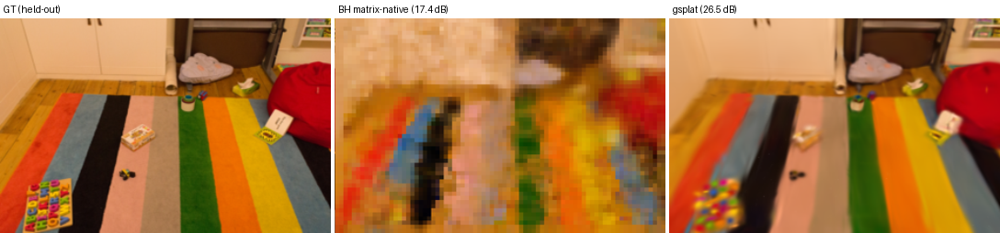
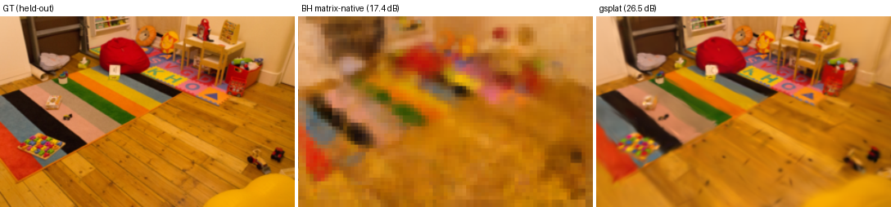
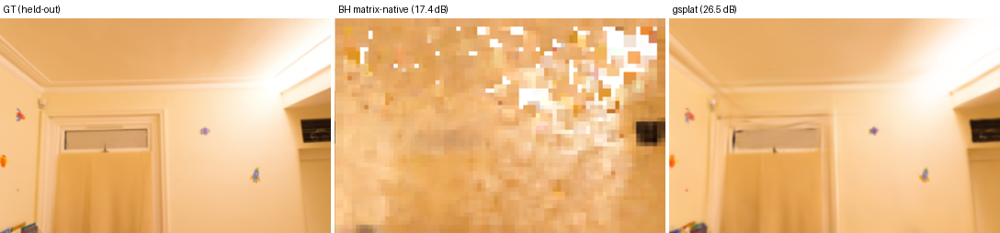

# BH matrix-native 3DGS — playroom held-out representative views

Visual companion to the numeric card (`outputs/bench/playroom_G100k_multiview.json`): the
**Blackhole-trained matrix-native 3DGS** playroom model rendered at 3 held-out views, paired with the
GPU gsplat panels (`docs/gsplat-real-views.md`) for a real-scene **GPU gsplat vs BH** comparison.

## GT | BH matrix-native | gsplat (the three-way compare)

`docs/compare-views/playroom_{0,1,2}.png` — each row is **GT (held-out) | BH matrix-native (17.4 dB) |
gsplat (26.5 dB)** at the **same held-out view** (colmap 8 / 16 / 24, the views the GPU panels use —
found by image-matching, then rendered identically on the BH side). GT + gsplat columns come from the
GPU panels (`docs/gsplat-real-views.md`); the BH column is our render. The gap is plain: GT and gsplat
are crisp; ours captures the scene's color/structure (the rug, the toys, the layout) but is blurry — a
representation ceiling of the depth-free weighted-sum blend, not a training bug (test≈train).

Build: `python3 tools/playroom_gt_bh_nv.py` (CPU; crops the gsplat/GT columns from the GPU panels +
our BH render — gsplat can't be re-rendered here, no gsplat .ply / no GPU on the BH host).

## The BH side (GT | render)

`docs/bh-views/playroom_holdout_{0,1,2}.png` — GT (held-out) | BH render, colmap 8 / 16 / 24.

| | |
|---|---|
| scene / res | playroom, trained 1264×832 (downscale 1) |
| model | 100,000 gaussians, `outputs/bench/playroom_G100k_mv.ply` (gitignored) |
| training | `resident_traced --multi-view --device-binning`, 196 train / 29 held-out, 6000 iters |
| **held-out PSNR** | **17.37 dB** (train 17.08 → generalizes) |
| renderer | OUR matrix-native render (poly-splat `(1−Q/k)₊²` + weighted-sum blend), CPU binned (`tools/bh_views.py`) |

For context, GPU standard 3DGS on playroom reaches ~26.5 dB (crisp) with 1–3M gaussians / 30k iters
(`docs/gsplat-real-views.md`). The ~9 dB gap = the matrix-native representation limit at high res + far
fewer gaussians/iters, **not** a training bug (test≈train confirms a genuine multi-view 3D reconstruction).

> NOTE: the `.ply` is fit to OUR renderer (the math differs from standard 3DGS — GEMM-native blend, no
> exp / no depth sort). A standard 3DGS viewer renders exp-splat + sorted alpha and will NOT reproduce
> these images — the faithful view is this binned render.

Regenerate: `python3 tools/bh_views.py` (CPU, loads the .ply, no device needed).
