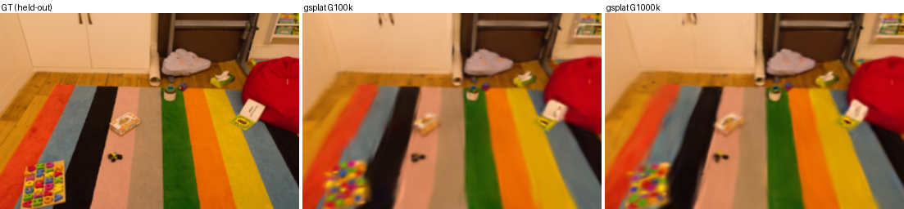
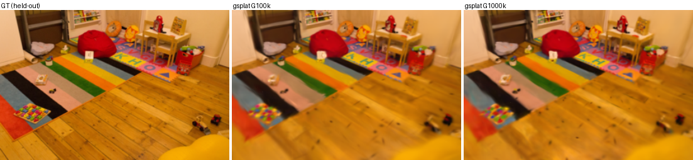
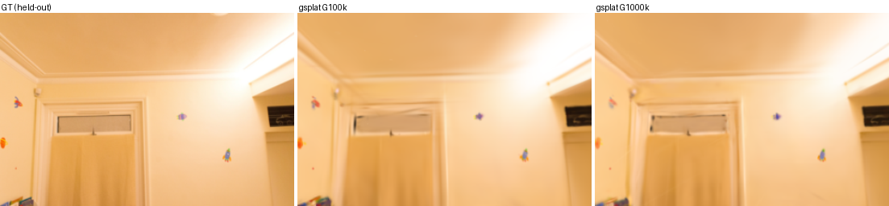

# Representative held-out views — gsplat on real COLMAP scenes

Visual confirmation of the GPU-side real-scene accuracy (TODO F1, `tools/gsplat_real_train.py`).
Each panel = `GT (held-out) | gsplat@G100k | gsplat@G1M` for a held-out playroom test view
(downscale=4, 30000it, fixed-count, points-init). Held-out PSNR ~26.5 dB; G100k≈G1M (quality
saturates at G=100k, no-ADC). Heavy `.ply`s stay local (gitignored); only these panels are committed.

